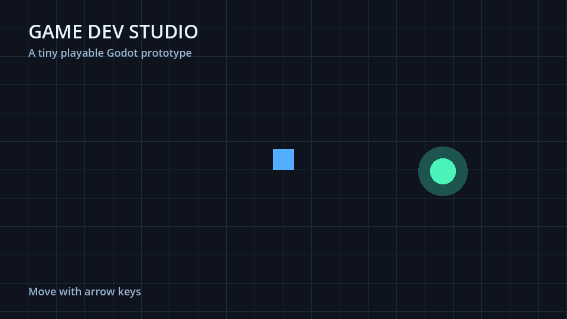

# Godot prototype workflow

This is a small project you can open in Godot 4.7. It starts a playable 2D
scene: use the arrow keys to move the square. The files live under
`examples/godot/project/`.



From this repository's root, run:

```sh
godot --headless --path examples/godot/project --quit-after 2
```

The command checks that the project loads and runs two frames. For a visual
check, open `examples/godot/project/project.godot` in the Godot editor and
press Play. Godot is not installed by this repository.

For an agent workflow, ask the `prototype` skill to add one mechanic to this
project, run the headless command, then use `qa-test` to review the result.
