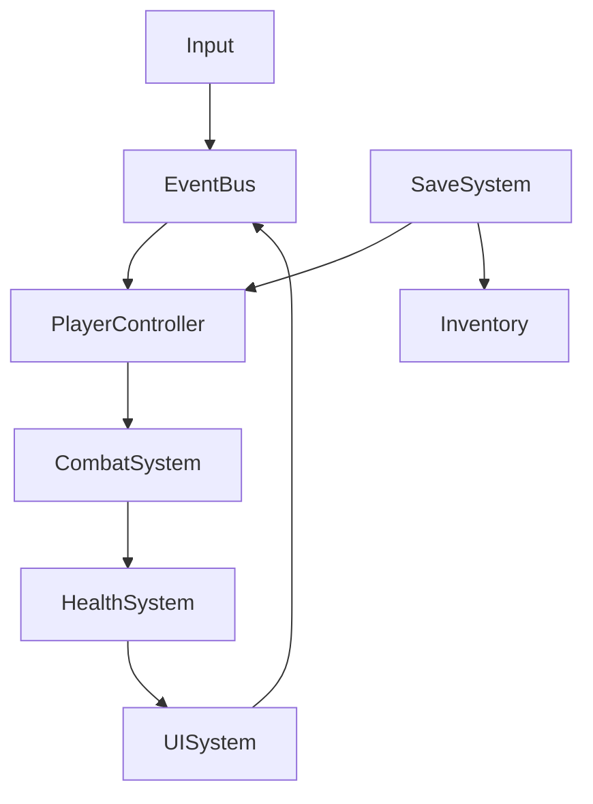

# Game Dev Architecture — System Architecture Design

## 🎯 Purpose

Design the technical architecture of a game project: system decomposition,
dependency mapping, key technical decisions, and data flow. Produces a living
architecture document that evolves with the project.

## 🤖 Multi-Platform Notes

| Platform | Notes |
|----------|-------|
| **OpenClaw** | Best for writing structured docs and architecture files. Can create multiple linked files in `arch/` folder. |
| **Claude Code** | Can write ADRs, architecture docs, and even stub out code structure. Good for generating interfaces. |
| **Cursor/Windsurf** | Excellent for architecture that maps to actual code. Can generate class skeletons and interfaces. |
| **GitHub Copilot** | Can help with architecture-in-code (interfaces, classes). Use chat for higher-level design. |
| **Generic LLM Chat** | Output architecture diagrams as ASCII art or Mermaid. Provide file structures as code blocks. |
| **Any AI** | All can guide through architecture decisions. Document-producing AIs can write the files. |

**Note:** For ASCII diagrams, use Monospace in any AI. For Mermaid diagrams,
check if the platform supports rendering.

---

## 📂 Document Structure

Create in `game-dev-studio/arch/`:

```
arch/
├── index.md              ← Architecture overview
├── 01-system-map.md      ← System overview + dependency map
├── 02-data-flow.md       ← Data flow diagrams
├── 03-scene-management.md ← Scene loading, state machine
├── 04-networking.md      ← (If applicable) multiplayer arch
├── 05-serialization.md   ← Save/load system
├── 06-performance.md     ← Performance budget, profiling
└── adr/
    ├── 001-use-godot-4-scene-system.md
    ├── 002-gdscript-over-csharp.md
    └── ...
```

---

## 🗺️ Phase 1: System Mapping

### Step 1.1 — Identify All Systems

Ask:
> **"What systems does the game need?"**

Common game systems:
- Input handling
- Player controller / state machine
- Camera system
- Combat / damage
- Health / status effects
- Inventory / items
- Economy / currency
- Progression / XP
- Save / load
- Audio manager
- UI / HUD
- Event / messaging bus
- Scene / level loader
- AI / behavior trees
- Physics / collision
- Animation
- VFX / particles
- Achievements
- Settings / configuration
- Multiplayer / networking *(if applicable)*

### Step 1.2 — Dependency Matrix

List systems and their dependencies:

```
System              | Depends On              | Used By
--------------------|-------------------------|----------------
PlayerController    | Input, Camera, Physics  | Combat, Animation
CombatSystem        | PlayerController, Health| UI (HUD)
Inventory           | PlayerController        | UI, SaveSystem
SaveSystem          | —                       | All persistent systems
UI                  | EventBus, Input         | —
EventBus            | —                       | EVERYTHING
```

### Step 1.3 — Dependency Graph

ASCII dependency graph (top → bottom = depends on):

```
        EventBus          Settings
          |  \              |
          |   \             |
        Input  Audio      SaveSystem
          |                 |
    PlayerController    Inventory  Progression
       /    |    \          |          |
   Camera Combat Animation  UI        UI
            |
          Health
```

**Rule:** No circular dependencies. If A depends on B and B depends on A,
extract the shared dependency into a third system.

---

## 📝 Phase 2: Architecture Decision Records (ADRs)

### Step 2.1 — When to Write an ADR

Write an ADR when you make a decision that:
- Is hard to reverse
- Affects multiple systems
- Has tradeoffs worth documenting
- Someone might ask "why did we do it this way?"

### Step 2.2 — ADR Template

Number sequentially in `arch/adr/`.

```markdown
# ADR-XXX: [Title]

## Status
[Proposed / Accepted / Deprecated / Superseded]

## Context
[Why is this decision needed? What's the problem?]

## Decision
[What did we decide? Be specific.]

## Options Considered
1. **[Option A]** — [pros/cons]
2. **[Option B]** — [pros/cons]
3. **[Option C]** — [pros/cons]

## Consequences
- [Positive consequence 1]
- [Negative consequence 1]
- [Risk / mitigation]

## Related
- [Link to related ADRs]
- [Link to GDD section]
```

### Step 2.3 — Common Game ADR Topics

| Topic | Example Decision |
|-------|-----------------|
| ECS vs OOP | "Use Godot's node-based composition instead of ECS" |
| State machine | "Use a hierarchical state machine for player controller" |
| Messaging | "Use a global EventBus (Observer pattern)" |
| Save format | "Use JSON for human-readable, or binary for performance" |
| Networking | "Use Steamworks P2P with rollback netcode" |
| Asset loading | "Load all assets upfront (no async) for this small game" |
| Data-driven design | "Use resource files (.tres) for all game balance data" |
| Scene management | "Single scene with add_child/remove_child, no scene switching" |

---

## 🔄 Phase 3: Data Flow

### Step 3.1 — Core Loop Data Flow

Trace the player's core action through the systems:

```
Player presses "Jump" (Input)
  → InputSystem emits ACTION_JUMP event (EventBus)
  → PlayerController reads input, applies force (Physics)
  → AnimationController switches to Jump animation (Animation)
  → AudioManager plays jump SFX (Audio)
  → Camera adjusts slightly (Camera)
  → UI shows no change
```

Document this for the core loop and 2-3 important interactions.

### Step 3.2 — Data Flow Template

```markdown
## [Interaction Name]

**Trigger:** [What starts this flow]

```
[System A] → [Data] → [System B] → [Result]
```

**Systems involved:** [list]
**Critical path:** [yes/no — is this on the frame-critical path?]
**Optimization needed?** [yes/no]
```

---

## 🏗️ Phase 4: Core Architecture Patterns

### Step 4.1 — Define Architecture Pattern

Ask:
> **"What architectural pattern fits best?"**
>
> ```
> 1) Scene-based (Godot) — each scene is self-contained, communicates via signals
> 2) Component-based (Unity) — MonoBehaviours on GameObjects
> 3) Actor-based (UE) — Actor classes with Components
> 4) ECS (any) — Entity-Component-System, data-oriented
> 5) MVC/MVP — Model-View-Controller (UI-heavy games)
> 6) Custom — hybrid approach
> ```

### Step 4.2 — System Interaction Diagram

Use Mermaid or ASCII:



---

## 📐 Phase 5: Detailed System Design

For each critical system, write a technical design section:

```markdown
## [System Name]

**Responsibility:** [One-sentence]

### Interface
```
// Public API
func process(delta: float)
func handle_event(event: GameEvent)

// Signals / Events emitted
signal on_[system]_[action](data)
```

### State
```
- [Persistent data saved]
- [Runtime state maintained]
```

### Lifecycle
1. `_init()` — allocate resources
2. `_ready()` — register with EventBus
3. `process(delta)` — update each frame
4. `handle_event(event)` — respond to events
5. `save() / load()` — serialize/deserialize
6. `_exit()` — cleanup, unregister

### Performance Notes
- [Frame cost estimate]
- [Memory estimate]
- [Optimization if needed]

### Testing Strategy
- [Unit test approach]
- [Integration test approach]
```

---

## ⚡ Phase 6: Performance Architecture

### Step 6.1 — Performance Budget

```markdown
# Performance Budget

| Resource | Budget | Notes |
|----------|--------|-------|
| CPU (main thread) | 8ms per frame | 60fps = 16ms total |
| CPU (worker threads) | 4ms | Physics, AI, particles |
| GPU | 10ms | Render pass |
| Draw calls | ≤100 (mobile), ≤500 (desktop) | |
| Poly count | 200k per frame (mobile), 1M (desktop) | |
| Texture memory | ≤256MB (mobile), ≤1GB (desktop) | |
| RAM | ≤512MB (mobile), ≤4GB (desktop) | |
| Loading time | ≤5s per scene | Non-negotiable |
```

### Step 6.2 — Profiling Plan

- Identify 3 most expensive systems
- Test on lowest target hardware
- Document optimization candidates
- Revisit when architecture changes

---

## 📄 Final Output

```markdown
# [Game Title] — Technical Architecture

**Version:** 1.0
**Date:** [YYYY-MM-DD]
**Author:** [Name]

## Architecture Overview
[One paragraph]

## System Map
[List all systems + their dependencies, see `01-system-map.md`]

## Key Decisions
| ADR | Decision | Status |
|-----|----------|--------|
| ADR-001 | [summary] | Accepted |
| ADR-002 | [summary] | Proposed |
| ... | ... | ... |

## Critical Paths
- [Core mechanic] — latency-sensitive, optimize first
- [Save/Load] — not latency-sensitive, optimize later

## Performance Targets
- **Platform:** [target]
- **Frame budget:** [X ms]
- **Memory budget:** [X MB]

## Architecture Pattern
[Pattern name with rationale]

## Next Steps
- [ ] Write remaining ADRs
- [ ] Implement core system stubs
- [ ] Set up EventBus
- [ ] Begin `sprint-dev`
```
